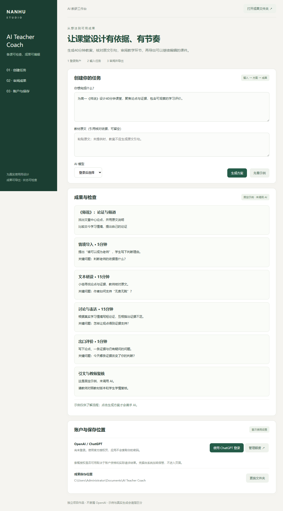

# AI Teacher Coach · 有原文依据的备课与课件工作台

面向 AI 产品经理 / 解决方案岗位的项目案例。

使用场景：教师希望快速整理课堂，但 AI 引文错误与时间分配失衡会增加复核成本。现有网页包含备课功能，升级增加可检查的证据路径和桌面入口。

产品决策：教案必须包含目标、具体师生活动、关键问题和总计40分钟的环节。用户提供教材原文时逐字核对 AI 引句；未提供原文时不把知识库命中或流畅文字视为可靠引文。

具体能力：桌面官方 ChatGPT 登录、结构化教案校验、引用拒绝、可编辑 PPTX 导出。网页新增 `/review` 原文核对页面，输入留在当前浏览器，刷新清空；可以导出核对记录。

已验证：网页真实浏览器的样例错误发现、修正、JSON下载、刷新清空及移动端布局；后台不会把未知或空主题标成已验证知识。桌面窗口、未登录提示、固定示例标识和真实 PPTX 文件内容通过测试。真实 AI 生成与教师课堂效果尚未验证。

演示路线：桌面登录 → 输入学情、课题和教材原文 → 生成40分钟教案 → 检查活动与引文 → 导出 PPTX → 教师复核后使用。也可以在网页原文核对页用“受业/授业”样例查看可解释的错误定位。

后续评价：教师复核耗时、引文错误漏检率、修改后采用比例与真实课堂适用度。逐字匹配不证明教材权威、版本正确或教学质量；目前没有教师用户研究结论。

[桌面使用与构建](DESKTOP.md)
